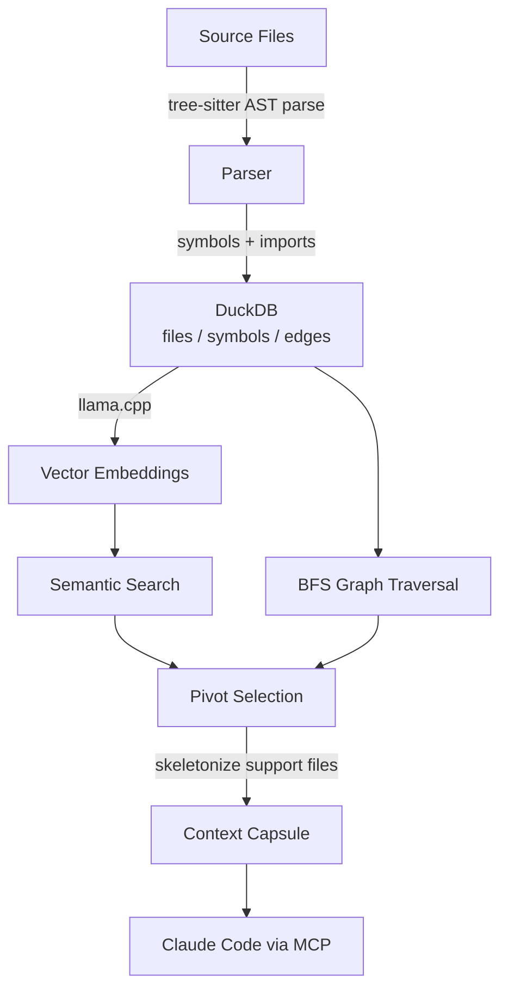
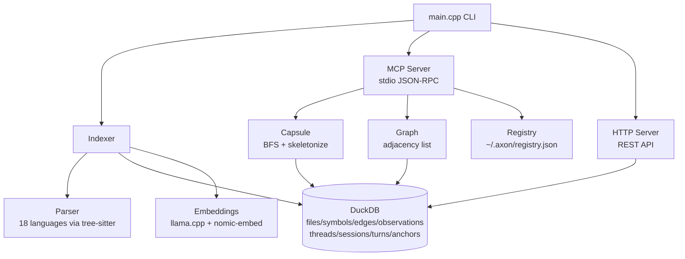

# axon — Context Engine for AI Coding Agents

[](LICENSE)
[](https://github.com/HideakiSolutions/axon/actions/workflows/build.yml)
[](https://github.com/HideakiSolutions/axon/actions/workflows/lint.yml)
[](CMakeLists.txt)
[](https://docs.anthropic.com/claude-code)
[](src/mcp/server.cpp)

<p align="center">
  <picture>
    <source media="(prefers-color-scheme: dark)" srcset="docs/assets/banner-dark.png">
    
  </picture>
</p>

> *O axônio transmite sinais de forma eficiente entre neurônios. Axon faz o mesmo para agentes de IA.*

---

## Table of Contents

- [What is axon?](#what-is-axon)
- [What this does, in plain English](#what-this-does-in-plain-english)
- [How it works](#how-it-works)
- [Token reduction](#token-reduction)
- [MCP Tools (27)](#mcp-tools-27)
- [Dialogue Layer](#dialogue-layer)
- [HTTP Mode & Axon Web](#http-mode--axon-web)
- [Multi-repo Registry](#multi-repo-registry)
- [Supported languages](#supported-languages-15)
- [Prerequisites](#prerequisites)
- [Installation](#installation)
- [Quick Start](#quick-start)
- [Architecture](#architecture)
- [Database schema](#database-schema)
- [Comparison Matrix](#comparison-matrix)
- [Roadmap](#roadmap)
- [Getting Help](#getting-help)
- [Security](#security)
- [Contributing](#contributing)
- [License](#license)
- [Português (BR)](#português-br)

---

## What is axon?

Axon is a local MCP (Model Context Protocol) server written in C++20 that delivers **surgical context** for AI coding agents. Instead of dumping entire files into the context window, axon builds a precise dependency graph of your codebase and assembles a token-budget-aware "context capsule" — only the pivot files and the relevant signatures of their dependencies.

It integrates directly with Claude Code via MCP, responding to `get_context_capsule`, `get_impact_graph`, and 25 other tools, all serving one goal: **let the agent see exactly what it needs, nothing more**.

Axon also ships a native **Dialogue Layer** — structured conversation memory directly in the same DuckDB store. Threads, sessions, turns, and auto-anchors to code artifacts, all locally stored and semantically searchable. `get_context_capsule` can return relevant past conversations alongside code context in a single token budget.

Axon also ships a native **Web mode** (`axon web`) with a browser graph explorer at `/` plus the same REST API previously exposed by `axon serve --http`.

For agent setups that previously used RTK for shell-output reduction, see [Axon-first context and shell filtering](docs/en/axon-primary-rtk-optional.md). Axon is the primary path for context capsules, skeletons, shell filters, metrics, and CCR recovery; RTK can remain installed as an optional compatibility fallback.

## What this does, in plain English

**Use case 1 — Before a refactor:** You're about to change a utility function. Run `get_impact_graph` to see every file that depends on it. Then run `get_tests_for` to know which tests to re-run. No guessing.

**Use case 2 — Debugging:** A symbol is misbehaving. Run `get_callers` to find every file that imports the function defining it. Then `get_skeleton` on those files to see their structure without reading full bodies.

**Use case 3 — Onboarding a new codebase:** Run `get_overview` to surface the most coupled files and the most-referenced symbols — the nervous center of the project — in seconds.

**Use case 4 — Cross-session memory:** Found something important? `save_observation` persists it to DuckDB with a vector embedding. Future sessions retrieve it with `search_memory`.

**Use case 5 — Multi-repo blast radius:** Changed a shared library? `group_impact` cross-references all registered repos in `~/.axon/registry.json` and returns which files in other projects depend on the same module path.

**Use case 6 — Structured conversation memory:** Use `thread_create` + `session_start` + `turn_add` to persist every relevant exchange. Axon automatically detects file paths and symbol names in turn content and links them to the dependency graph (`auto-anchor`). Later, `turn_search` retrieves past discussions by semantic similarity. Pass `dialogue_budget` to `get_context_capsule` and receive code + conversations in one unified response.

## How it works

```
your project → [AST parse via tree-sitter] → [dependency graph] → [embeddings via llama.cpp] → DuckDB
                                                                                                    ↓
  Claude ← [~8k token capsule] ← [BFS traversal + skeletonize] ← [semantic + graph search]
```

**Pivot files** (most relevant to the query) arrive complete.
**Support files** (nearby dependencies) arrive as signatures only.
Result: a context capsule that fits your token budget with zero information loss on the critical path.

<p align="center">
  
</p>

<details>
<summary>Ver diagrama em texto (Mermaid)</summary>



</details>

---

## Token reduction

Measured on real projects:

| Project | Language | Without axon | With axon | Reduction |
|---------|----------|-------------|-----------|-----------|
| event-platform | TypeScript | 37,509 | 8,774 | **76%** |
| poynt-hub | TypeScript | 17,949 | 1,516 | **91%** |
| mcp-factory | Python | 22,480 | 1,389 | **93%** |
| event-platform | Python | 42,546 | 2,353 | **94%** |

Compression safety: `get_context_capsule` can enable `compression="body"` for oversized symbol bodies. Before lossy compression, Axon classifies the payload as source code, JSON, diff, log, Markdown, plain text, or binary-like data. Binary-like streams and impossible budgets pass through unchanged, compressed output is accepted only when the final token estimate is lower than the original, and lossy capsule body slices get CCR artifact IDs for exact recovery through `artifact_retrieve`. Structured capsule file entries include `source_ref` and `expand_command` so agents can trace and expand context through Axon tools before falling back to raw file reads.

At 1,000 calls/day with a typical TypeScript project (Claude Sonnet — $3/M input tokens):

| | Without axon | With axon | Savings |
|--|-------------|-----------|---------|
| Tokens/call | 37,509 | 8,774 | −76% |
| Cost/day | $112.50 | $26.32 | **−$86/day** |
| Cost/month | $3,375 | $790 | **−$2,585/month** |

---

## MCP Tools (27)

| Tool | Parameters | Description |
|------|-----------|-------------|
| `get_context_capsule` | `query`, `pivot_files?`, `token_budget?`, `dialogue_budget?`, `no_cache?`, `compression?` | Token-efficient context capsule: pivots complete + support skeletonized + optional past turns; `compression="body"` enables type-aware lossy body compression |
| `get_overview` | `limit?` | Top files by coupling + top symbols — ideal for onboarding |
| `get_impact_graph` | `files[]` | Which files depend on the given files (bidirectional BFS) |
| `get_callers` | `symbol_name`, `file_path?`, `limit?` | Files that import the file defining a symbol |
| `get_skeleton` | `files[]` | Signatures-only view (no function bodies) |
| `get_tests_for` | `files[]` | Test files that import the given files (by path convention) |
| `search_memory` | `query`, `limit?` | Semantic search over saved observations |
| `save_observation` | `content`, `tags?`, `file_path?` | Persist an insight for future retrieval |
| `run_pipeline` | `root?` | Full project index (parse + graph + embeddings) |
| `index_paths` | `paths[]`, `prune?` | Incremental reindex of specific paths |
| `rename` | `symbol_name`, `new_name`, `dry_run?` | Graph-assisted rename across the codebase |
| `route_map` | `framework?` | List all detected HTTP routes with handler files (optionally filter by framework) |
| `api_impact` | `route_path` | Handler file + impact graph for an HTTP route |
| `detect_changes` | `ref?` | Symbols and files affected by recent git changes (default ref: `HEAD`) |
| `group_list` | — | List all repos registered in `~/.axon/registry.json` |
| `group_impact` | `file`, `group?` | Cross-repo blast radius for a file path, optionally scoped to a group |
| `thread_create` | `name`, `kind?` | Create a named conversation scope (project \| person \| topic) |
| `thread_list` | — | List all threads |
| `session_start` | `thread_id`, `label?` | Open a new working session within a thread |
| `session_end` | `session_id`, `compute_digest?` | Close session; optionally generate and embed a digest |
| `turn_add` | `session_id`, `role`, `content` | Append a turn (user \| assistant); auto-anchors to code artifacts |
| `turn_search` | `query`, `limit?`, `thread_id?` | Semantic search over all turns, optionally scoped to a thread |
| `session_get` | `session_id`, `limit?` | Retrieve turns for a session |
| `thread_get` | `thread_id` | List sessions within a thread with digest summaries |
| `anchor_link` | `turn_id`, `file_id?`, `symbol_id?`, `kind?` | Manually link a turn to a file or symbol |
| `dialogue_context` | `query`, `file_paths?[]`, `limit?`, `thread_id?` | Past turns related to files or semantic query |
| `artifact_retrieve` | `artifact_id` | Retrieve original content for a CCR artifact emitted by lossy compression |

### Agentic workflow coverage

| Dev flow | Canonical tool sequence |
|----------|------------------------|
| Semantic exploration | `get_context_capsule` |
| Onboarding / vibe coding | `get_overview` → `get_context_capsule` |
| Before refactor | `get_impact_graph` + `get_tests_for` |
| Debug / root cause | `get_callers` → `get_skeleton` → `get_context_capsule` |
| Quick structure inspection | `get_skeleton` |
| Cross-session memory | `search_memory` / `save_observation` |
| API change impact | `route_map` → `api_impact` |
| Git change blast radius | `detect_changes` |
| Multi-repo impact | `group_list` → `group_impact` |
| Graph-safe rename | `rename` |
| Start a dialogue session | `thread_create` → `session_start` → `turn_add` |
| Recall past conversations | `turn_search` / `dialogue_context` |
| Code + conversation context | `get_context_capsule` with `dialogue_budget` |

---

## Dialogue Layer

Axon stores conversation history natively in the same DuckDB database used for code context, using the same embedding pipeline and the same token-budget model.

### Concepts

| Concept | Description |
|---------|-------------|
| **Thread** | A named scope — a project, person, or topic |
| **Session** | A bounded working window within a thread (e.g., a coding sprint) |
| **Turn** | A single verbatim exchange (role: `user` \| `assistant`) — never modified after insert |
| **Anchor** | A link from a Turn to a file or symbol in the dependency graph |
| **Digest** | A compressed summary of a session in Axon Digest Format (ADF), embedded for semantic search |

### Auto-anchor

When a Turn is added via `turn_add`, Axon automatically scans its content for:

1. **File paths** — regex match against extensions (`.ts`, `.py`, `.rs`, etc.) → resolved against the `files` table via `LIKE '%match%'`
2. **Symbol names** — word-boundary match against a hot-cache of the top-500 most-referenced symbols in the dependency graph → resolved against the `symbols` table

Matches generate `turn_anchors` rows linking the Turn to code artifacts. No external NLP is required — Axon uses its own graph data for precision impossible with generic models.

### Digest (ADF — Axon Digest Format)

Rule-based session summary generated on `session_end`. Same principle as `skeletonize()` — no LLM generation, only embedding for future semantic search:

```
[SESSION: Sprint 1 auth review | 2025-01-10T09:00 → 2025-01-10T11:30]
[ANCHORS: src/auth/token.ts, validateToken, refreshSession]
---
user: The TTL for auth/token.ts must be 7 days — don't summarize this!
assistant: Confirmed — the TTL is set in validateToken at line 42. The refreshSession...
```

### Integration with `get_context_capsule`

Pass `dialogue_budget` (token count) to `get_context_capsule` and the response includes a `related_turns` array — past conversations anchored to the same pivot files, ranked by semantic similarity, within budget:

```json
{
  "pivot_files": [...],
  "support_files": [...],
  "related_turns": [
    {
      "role": "user",
      "content": "The TTL for auth/token.ts must be 7 days",
      "session_label": "Sprint 1 auth review",
      "thread_name": "auth-module",
      "ts": "2025-01-10T09:15:00"
    }
  ]
}
```

When `dialogue_budget=0` (the default), behavior is bit-for-bit identical to the previous version — zero overhead.

### Quick example

```bash
# Start MCP server and use dialogue tools via Claude Code:
# 1. Create a thread for the auth module
# thread_create { "name": "auth-module", "kind": "project" }

# 2. Start a working session
# session_start { "thread_id": 1, "label": "Token TTL review" }

# 3. Add turns
# turn_add { "session_id": 1, "role": "user", "content": "auth/token.ts must have 7-day TTL" }
# turn_add { "session_id": 1, "role": "assistant", "content": "Confirmed — validateToken line 42." }

# 4. End session (generates digest + embedding)
# session_end { "session_id": 1, "compute_digest": true }

# 5. Retrieve past context alongside code
# get_context_capsule { "query": "auth token TTL", "dialogue_budget": 1000 }
```

---

## HTTP Mode & Axon Web

Axon can expose a REST API instead of (or alongside) the MCP stdio protocol:

```bash
# Browser UI + REST API for one project
axon web --port=7070

# REST API only, compatible with older axon-web frontends
axon serve --http --port=7070

# Aggregate all registered repos into one graph
axon web --port=7070 --all

# Specific group from registry
axon web --port=7070 --group=backend
```

**REST endpoints:**

| Method | Path | Description |
|--------|------|-------------|
| `GET` | `/api/graph` | Full node+edge graph (file-level by default) |
| `GET` | `/api/graph?mode=symbol` | Symbol-level graph: nodes are functions/classes/methods/interfaces/types/structs/namespaces |
| `GET` | `/api/symbol/:id` | Symbol detail with callers |
| `GET` | `/api/search?q=` | Full-text + semantic search |
| `GET` | `/api/observations?q=&limit=` | List or semantic-search saved observations |
| `GET` | `/api/capsule?q=&budget=&pivots=` | Assemble token-budget context capsule |
| `GET` | `/api/artifact/:id` | Retrieve original content for a CCR artifact |
| `GET` | `/api/metrics` | Telemetry aggregates when enabled; graph/cache metrics otherwise |
| `GET` | `/api/threads` | List all conversation threads |
| `GET` | `/api/threads/:id/sessions` | Sessions belonging to a thread |
| `GET` | `/api/sessions/:id/turns` | Turns within a session |
| `GET` | `/api/dialogue/search?q=&limit=&thread_id=` | Semantic search over turns |

The built-in page renders the indexed graph directly from `/api/graph`. The companion **[axon-web](https://github.com/HideakiSolutions/axon-web)** frontend can still consume the same API for the richer Sigma.js + Graphology experience.

Telemetry is local and off by default. Enable it with `AXON_TELEMETRY=1` or `telemetry = true` in `.axon/config.toml`; events are stored in DuckDB and exposed through `/api/metrics`. Totals remain backward-compatible, and `layers` separates savings for `retrieval`, `shell_filtering`, `compression`, `cache`, `ccr`, and `unknown`. Remote POST is attempted only when `AXON_TELEMETRY_ENDPOINT` is set, and failures are ignored.

Shell output filtering starts with `axon filter <auto|diff|lint|log|grep|json|package|test|tsc|text> [--budget=N] [--metrics=json]`, which reads stdin, classifies output before compression, and passes through unchanged when filtering is unsafe or does not save tokens. `grep`/`rg`-style output is grouped by file with per-file omissions and long-line truncation, `log` output counts levels, deduplicates repeated messages, and keeps important/error edge lines, JSON output is parsed into a schema/shape summary that strips raw values, `lint` output groups diagnostics by file and rule, `package` output collapses repeated npm/pnpm/yarn install operations while keeping errors and summaries, `test` output keeps failure blocks and final summaries, and `tsc`/TypeScript compiler diagnostics are grouped by file and diagnostic code. Lossy shell summaries are emitted with an `axon:ccr` marker and `ccr_artifact_id` stderr field; use `axon artifact-retrieve <id>` to recover the exact original stdin. Default metrics are human-readable on stderr; pass `--metrics=json` for machine-readable command metrics. When `AXON_TELEMETRY=1` and a project DB exists, savings are recorded in the `shell_filtering` layer.

### Watch mode

```bash
axon watch [path] --interval-ms=1000 --debounce-ms=500
```

`watch` uses portable polling and calls the same incremental indexer as `axon index-paths`. Claude hooks remain the fastest path for Claude Code edits; watch mode covers external editors, git checkouts, generators, and manual deletes.

### VS Code

The release includes `axon-vscode-<version>.vsix`. Install it with VS Code's "Install from VSIX" command, then configure `axon.path` if the binary is not on `PATH`. The extension starts `axon lsp`, exposes `Axon: Index Workspace`, and opens the local explorer with `Axon: Open Web Explorer`.

---

## Multi-repo Registry

Axon maintains a global registry at `~/.axon/registry.json`. Every `axon index` and `axon serve` call auto-registers the current repo.

```bash
# List registered repos and groups
axon serve --mcp  # then call group_list via MCP

# Cross-repo blast radius
# (via MCP) group_impact { "file": "src/auth/token.ts" }
```

Registry format (`~/.axon/registry.json`):

```json
{
  "repos": [
    { "name": "axon", "root": "/home/alice/projects/axon", "db_path": "..." }
  ],
  "groups": {
    "backend": ["axon", "api-service", "worker-pool"]
  }
}
```

---

## Supported languages (18)

| Language | Extensions |
|----------|-----------|
| TypeScript | `.ts`, `.tsx` |
| JavaScript | `.js`, `.jsx`, `.mjs`, `.cjs` |
| Python | `.py` |
| Rust | `.rs` |
| Go | `.go` |
| C# | `.cs` |
| PHP | `.php` |
| Dart | `.dart` |
| Java | `.java` |
| Bash | `.sh`, `.bash` |
| C++ | `.cpp`, `.cc`, `.cxx`, `.hpp`, `.h` |
| Kotlin | `.kt`, `.kts` |
| Vue | `.vue` (SFC with TS/JS sub-parse) |
| Lua | `.lua` |
| Nix | `.nix` (bindings, inherit, `import` edges) |
| Ruby | `.rb` |
| Swift | `.swift` |
| Scala | `.scala`, `.sc` |

---

## Prerequisites

| Tool | Version | Required |
|------|---------|----------|
| GCC or Clang | ≥ 12 | Yes |
| CMake | ≥ 3.20 | Yes |
| Git | any | Yes |
| ccache | any | No (recommended — speeds up rebuilds ~70%) |
| Python + pip | ≥ 3.8 | No (only for embedding model download) |

---

## Installation

### macOS & Linux — Homebrew (recommended)

```bash
brew tap HideakiSolutions/axon
brew install axon
```

After installation, wire axon into a Claude Code project (installs Grep/Glob, raw shell-output, build, auto-index, and write-through hooks + injects the workflow guide):

```bash
axon-setup /path/to/your-project
```

### Direct download (no Homebrew)

Download the pre-built binary for your platform from the [releases page](https://github.com/HideakiSolutions/axon-releases/releases/latest):

| Platform | File |
|----------|------|
| Linux x86-64 | `axon-X.Y.Z-linux-x64.tar.gz` |
| macOS Apple Silicon | `axon-X.Y.Z-macos-arm64.tar.gz` |

```bash
# Example for Linux x86-64 (replace X.Y.Z with the latest version)
VERSION=1.2.0
curl -L -o axon.tar.gz \
  "https://github.com/HideakiSolutions/axon-releases/releases/download/v${VERSION}/axon-${VERSION}-linux-x64.tar.gz"
tar xzf axon.tar.gz
cd "axon-${VERSION}-linux-x64"
./install.sh /path/to/your-project
```

### Build from source

> The steps below are for contributors or platforms without a pre-built binary. For a faster start, use [Homebrew](#macos--linux--homebrew-recommended) or [direct download](#direct-download-no-homebrew) above.

See [CONTRIBUTING.md](CONTRIBUTING.md) for full build instructions (requires CMake, Ninja, and a C++20 compiler). Quick summary:

#### 1. Clone with submodules

```bash
git clone --recurse-submodules https://github.com/HideakiSolutions/axon.git
cd axon
```

#### 2. Build

```bash
mkdir build && cd build
cmake .. -DCMAKE_BUILD_TYPE=Release
make -j2
```

> Use `-j2` maximum. Higher parallelism during the llama.cpp + 18 grammar compilation can lock up shared hosts. First build ~10–12 min; subsequent builds with `ccache` ~70% faster.

#### 3. Library path

Release tarballs are relocatable: Linux uses `$ORIGIN/../lib`, macOS uses `@executable_path/../lib`, and Windows ships `duckdb.dll` next to `axon.exe`. `LD_LIBRARY_PATH` is only needed for ad hoc source-tree runs when your local build cannot find `third_party/duckdb/lib`.

#### 4. Embedding model (optional — enables semantic search)

```bash
pip install huggingface_hub
huggingface-cli download nomic-ai/nomic-embed-text-v1.5-GGUF \
    nomic-embed-text-v1.5.Q4_K_M.gguf \
    --local-dir ./models/
```

Without the model, all tools work normally except `search_memory` and the semantic-query mode of `get_context_capsule`.

#### 5. Configure Claude Code

Add to `~/.claude.json` under `mcpServers`:

```json
{
  "mcpServers": {
    "axon": {
      "command": "/path/to/axon/build/axon",
      "args": ["serve"],
      "env": {
        "LD_LIBRARY_PATH": "/path/to/axon/third_party/duckdb/lib"
      }
    }
  }
}
```

For Codex, add the equivalent server entry to `~/.codex/config.toml`:

```toml
[mcp_servers.axon]
command = "/path/to/axon/build/axon"
args = ["serve"]

[mcp_servers.axon.env]
LD_LIBRARY_PATH = "/path/to/axon/third_party/duckdb/lib"
```

If two clients (a second Claude session, Codex, `axon web`) run `axon serve`
against the same `.axon/index.duckdb`, DuckDB only grants the write lock to
one of them. Axon handles this transparently: the process holding the lock
registers itself as the repo's owner (pid, localhost port, and an auth token
in `~/.axon/registry.json`), and any latecomer serve forwards its tool calls
to the owner over `127.0.0.1`. When the owner exits, the latecomer takes the
lock on its next tool call and promotes itself to owner. You should only see
a lock error if the proxy path is also unavailable (e.g. the owner is an
older axon binary without a peer listener). To inspect active servers:

```bash
pgrep -af 'axon.*serve'
pwdx <pid>
```

---

## Quick Start

```bash
export LD_LIBRARY_PATH=/path/to/axon/third_party/duckdb/lib

# 1. Index your project
axon index /path/to/your-project

# 1a. (Optional) Force re-resolution of edges/symbols even when file hashes are unchanged
#     Required after changing .axon/config.toml granularity or after edits outside the
#     write-through hook flow.
axon index --force

# 2. Check what was indexed
axon status

# 3. Start MCP server (Claude Code connects automatically)
axon serve

# 4. (Optional) Start browser graph explorer + REST API
axon web --port=7070
# Then open http://localhost:7070
```

### Project config — symbol-level granularity

Create `.axon/config.toml` in your project root to opt into symbol-level edges:

```toml
granularity = "symbol"   # default: "file"
```

When set, `axon index` runs the tree-sitter call graph extraction pass and populates `kind='calls'` edges with `from_symbol`/`to_symbol`. This unlocks the granular BFS path in `get_context_capsule` and the `?mode=symbol` HTTP endpoint.

Run `axon index --force` after toggling this setting so that already-indexed files are reprocessed.

Install axon into a Claude Code project (wires hooks + injects workflow guide):

```bash
bash /path/to/axon/scripts/install.sh /path/to/your-project
```

---

## Architecture

```
src/
├── main.cpp              # CLI: index | serve | capsule | skeleton | status
├── core/
│   ├── config.hpp/cpp    # Project root detection via .git walk-up
│   ├── db.hpp/cpp        # DuckDB connection + schema + migrations
│   ├── indexer.hpp/cpp   # File walk → parse → insert DB (2-pass: files then edges)
│   ├── graph.hpp/cpp     # In-memory adjacency list + bidirectional BFS
│   ├── capsule.hpp/cpp   # Pivot selection + token-budget context assembler
│   ├── skeleton.hpp/cpp  # Signatures-only view via tree-sitter
│   ├── embeddings.hpp/cpp # llama.cpp wrapper (embed + batch embed)
│   ├── registry.hpp/cpp  # Multi-repo registry (~/.axon/registry.json)
│   ├── rename.hpp/cpp    # Graph-assisted symbol rename
│   ├── git.hpp/cpp       # Git diff parsing for detect_changes
│   ├── routes.hpp/cpp    # HTTP route detection for route_map / api_impact
│   └── dialogue.hpp/cpp  # Dialogue Layer: threads/sessions/turns/anchors/digests
├── parser/
│   └── parser.hpp/cpp    # Language dispatcher + symbol/import extraction (18 langs)
└── mcp/
    ├── server.hpp/cpp    # stdio JSON-RPC 2.0 loop + all 27 MCP tool handlers
    ├── http_server.hpp/cpp # HTTP REST API + multi-repo graph aggregation
    └── protocol.hpp      # make_response / make_error / make_tool_result helpers
third_party/
├── duckdb/               # Pre-built shared library v1.2.2
├── llama.cpp/            # Submodule — inference engine for embeddings
├── tree-sitter/          # Core C API
├── tree-sitter-{lang}/   # 18 language grammar submodules
├── blake3/               # Fast file hashing (incremental reindex)
└── nlohmann-json/        # Header-only JSON
```

<p align="center">
  
</p>

<details>
<summary>Ver diagrama em texto (Mermaid)</summary>



</details>

---

## Database schema

```sql
-- Code graph
files        (id, path, language, hash, byte_size, indexed_at, skeleton)
symbols      (id, file_id, name, kind, start_line, end_line, signature, docstring, embedding FLOAT[768])
edges        (id, from_file, to_file, from_symbol, to_symbol, kind)  -- kind: imports | calls | extends
observations (id, content, file_path, embedding FLOAT[768], created_at)
routes       (id, method, path, handler_file, framework, file_id)
capsule_cache (query_hash, epoch, payload, created_at)
ccr_artifacts (artifact_id, kind, source_ref, content, token_estimate, created_at)

-- Dialogue Layer
threads      (id, name, kind, created_at)                              -- kind: project | person | topic
sessions     (id, thread_id, label, started_at, ended_at, digest, digest_embedding FLOAT[768])
turns        (id, session_id, role, content, ts, embedding FLOAT[768]) -- role: user | assistant
turn_anchors (id, turn_id, file_id, symbol_id, kind)                   -- kind: mentions | decides | questions
```

`from_symbol`/`to_symbol` are populated by:
- **Import resolution** (`kind='imports'`) — tries to match the import leaf name against a symbol with the same name on either side
- **Call graph extraction** (`kind='calls'`) — tree-sitter walks every function body and emits one edge per call site, with `from_symbol = enclosing function`, `to_symbol = matched callee anywhere in the project`

Symbol-level edges activate the granular BFS in `assemble_capsule` — pivots expand to their callers (depth=1), giving the LLM a focused map of relationships instead of full files.

---

## Comparison Matrix

| Capability | axon | Copilot Workspace | Cursor | Codeium |
|-----------|------|------------------|--------|---------|
| Local / offline | ✅ | ❌ | Partial | ❌ |
| Token-budget context | ✅ | ❌ | ❌ | ❌ |
| Dependency graph BFS | ✅ | ❌ | ❌ | ❌ |
| Cross-session memory | ✅ | ❌ | ❌ | ❌ |
| Structured conversation memory | ✅ | ❌ | ❌ | ❌ |
| Code-linked turn anchors | ✅ | ❌ | ❌ | ❌ |
| MCP protocol | ✅ | ❌ | ❌ | ❌ |
| Multi-repo registry | ✅ | ❌ | ❌ | ❌ |
| Graph visualization | ✅ (`axon web`) | ❌ | ❌ | ❌ |
| 18 languages | ✅ | ✅ | ✅ | ✅ |
| Zero cloud dependency | ✅ | ❌ | ❌ | ❌ |

---

## Roadmap

| Feature | Status | Notes |
|---------|--------|-------|
| 27 MCP tools | ✅ Done | Code context + dialogue layer + CCR artifact retrieval tools |
| HTTP REST API + axon-web | ✅ Done | Force-directed graph, repo filter, file tree, symbol mode |
| Multi-repo registry | ✅ Done | `~/.axon/registry.json`, groups, `--all` flag |
| Symbol-granular edges (calls) | ✅ Done | `kind='calls'` edges populated via tree-sitter call graph extraction |
| Symbol-granular capsule rendering | ✅ Done | `assemble_capsule` extracts only matched symbol bodies (signature + lines), not full files |
| Worktree exclusion + sweep purge | ✅ Done | `.worktrees/` ignored; `axon index` purges newly-ignored entries from DB |
| `axon index --force` | ✅ Done | Rebuild edges/symbols even when file hash unchanged |
| Dialogue Layer | ✅ Done | Threads/sessions/turns/anchors/digests — native DuckDB + 768-dim embeddings |
| Auto-anchor | ✅ Done | File path (regex) + symbol name (top-500 cache) detection on every `turn_add` |
| Dialogue context in capsule | ✅ Done | `get_context_capsule` accepts `dialogue_budget`; returns `related_turns` |
| Portable watch mode | ✅ Done | `axon watch` polling reindexes edits outside Claude Code |
| HNSW vector index (DuckDB VSS) | 🔄 Planned | Projects > 100k symbols |
| Filtered tags in `search_memory` | 🔄 Planned | |
| Capsule cache by query hash | 🔄 Planned | |
| Caller resolution beyond name match | 🔄 Planned | Type-aware resolution for overloaded callees |

---

## Getting Help

- **Discussions:** [GitHub Discussions](https://github.com/HideakiSolutions/axon/discussions)
- **Issues:** [GitHub Issues](https://github.com/HideakiSolutions/axon/issues)
- **Docs:** [docs/en/getting-started.md](docs/en/getting-started.md)
- **FAQ:** [docs/en/faq.md](docs/en/faq.md)

---

## Security

See [SECURITY.md](SECURITY.md) for the vulnerability reporting policy.

---

## Contributing

See [CONTRIBUTING.md](CONTRIBUTING.md). All contributions welcome — bug fixes, new language parsers, documentation, and performance improvements.

---

## License

MIT — see [LICENSE](LICENSE).

---

## Português (BR)

### O que é o axon?

Axon é um servidor MCP local em C++20 que entrega **contexto cirúrgico** para agentes de IA. Em vez de despejar arquivos inteiros na janela de contexto, o axon constrói um grafo de dependências do seu projeto e monta uma "cápsula de contexto" dentro de um orçamento de tokens configurável.

Axon também inclui uma **Camada de Diálogo** nativa: memória de conversação estruturada diretamente no mesmo DuckDB usado para o grafo de código. Threads, sessões, turns e âncoras automáticas para artefatos de código, tudo local e com busca semântica.

### Instalação rápida

```bash
git clone --recurse-submodules https://github.com/HideakiSolutions/axon.git
cd axon && mkdir build && cd build
cmake .. -DCMAKE_BUILD_TYPE=Release && make -j2

# Indexar seu projeto
export LD_LIBRARY_PATH=/caminho/para/axon/third_party/duckdb/lib
axon index /caminho/para/seu-projeto
axon serve
```

### Ferramentas MCP (26)

| Ferramenta | Descrição |
|-----------|-----------|
| `get_context_capsule` | Cápsula de contexto eficiente em tokens (aceita `dialogue_budget`, `no_cache`) |
| `get_overview` | Visão geral: arquivos mais acoplados + símbolos mais referenciados |
| `get_impact_graph` | Quais arquivos dependem dos arquivos fornecidos |
| `get_callers` | Arquivos que importam o arquivo que define um símbolo |
| `get_skeleton` | Apenas assinaturas (sem corpos de função) |
| `get_tests_for` | Testes que referenciam os arquivos fornecidos |
| `search_memory` | Busca semântica em observações salvas |
| `save_observation` | Persistir um insight para sessões futuras |
| `run_pipeline` | Indexação completa do projeto |
| `index_paths` | Reindexação incremental de caminhos específicos |
| `rename` | Renomear símbolo com assistência do grafo |
| `route_map` | Listar rotas HTTP detectadas (filtro por `framework` opcional) |
| `api_impact` | Impacto de uma rota HTTP no grafo de dependências |
| `detect_changes` | Símbolos e arquivos afetados por mudanças recentes no git (parâmetro `ref`, default `HEAD`) |
| `group_list` | Registro multi-repo (`~/.axon/registry.json`) |
| `group_impact` | Impacto cross-repo para um arquivo (filtro por `group` opcional) |
| `thread_create` | Criar escopo nomeado de conversação (project \| person \| topic) |
| `thread_list` | Listar todos os threads |
| `thread_get` | Listar sessões de um thread com resumos de digest |
| `session_start` | Abrir sessão de trabalho dentro de um thread |
| `session_end` | Encerrar sessão; gera e embeda um digest (ADF) |
| `turn_add` | Adicionar turn (user \| assistant) com auto-âncora em arquivos e símbolos |
| `turn_search` | Busca semântica sobre todos os turns |
| `session_get` | Recuperar turns de uma sessão |
| `anchor_link` | Vincular manualmente um turn a um arquivo ou símbolo |
| `dialogue_context` | Turns relacionados a arquivos ou query semântica |

### Modo Web

```bash
# Agregar todos os repos registrados em um grafo
axon web --port=7070 --all
# Abrir http://localhost:7070
```

### Redução de tokens (exemplos reais)

| Projeto | Sem axon | Com axon | Redução |
|---------|---------|---------|---------|
| event-platform (TS) | 37.509 | 8.774 | **76%** |
| mcp-factory (Python) | 22.480 | 1.389 | **93%** |

### Arquitetura

Axon usa tree-sitter para parsing de AST, DuckDB para armazenamento local do grafo e llama.cpp com nomic-embed-text para embeddings vetoriais (busca semântica). Tudo local, sem nuvem.

### Licença

MIT
