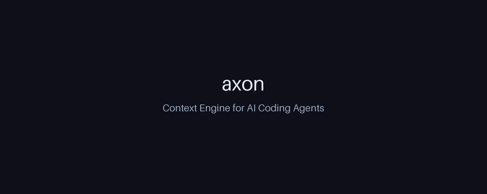
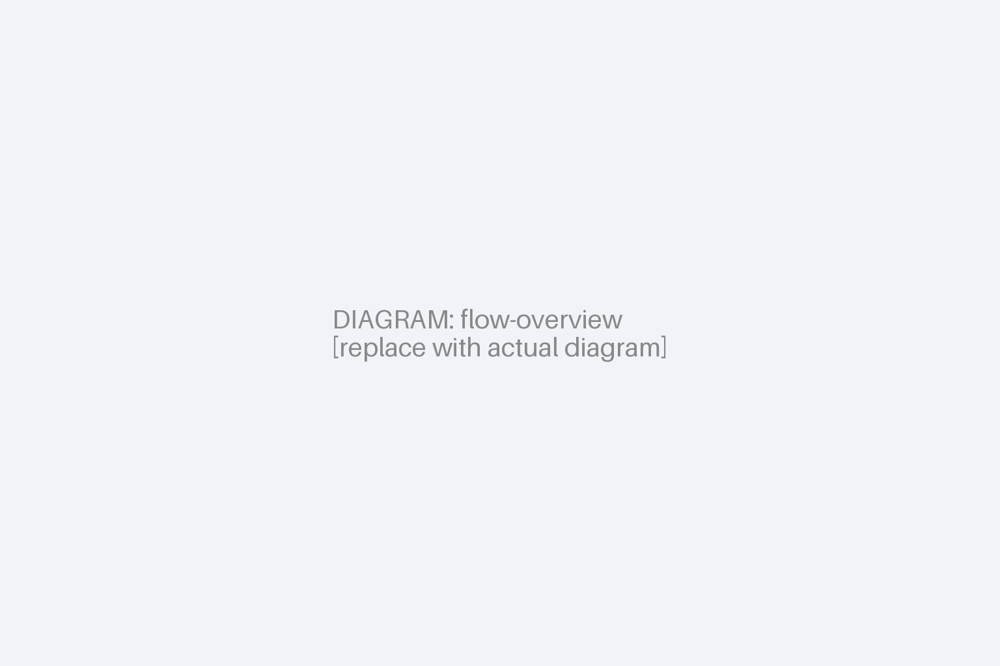
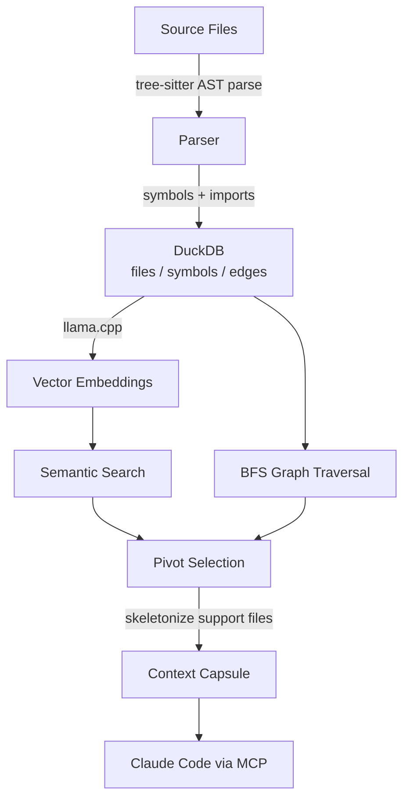
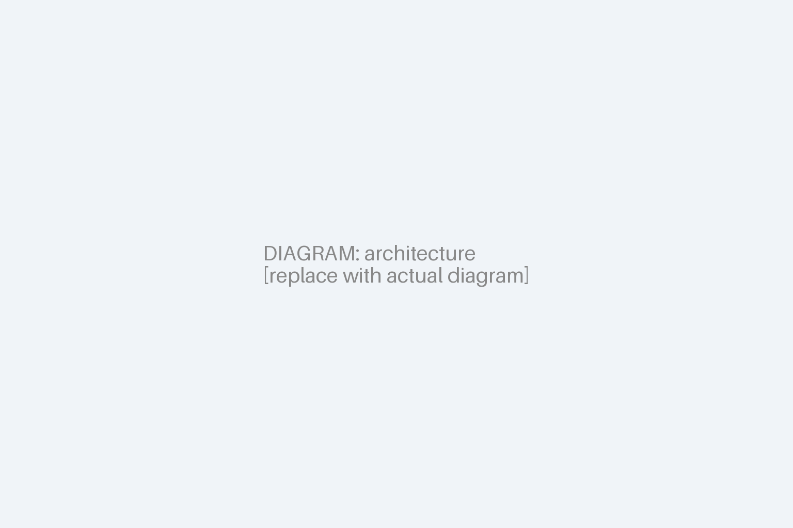
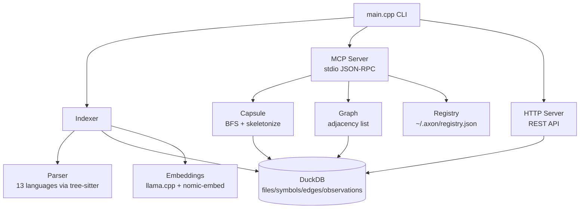

# axon — Context Engine for AI Coding Agents

[](LICENSE)
[](https://github.com/HideakiSolutions/axon/actions/workflows/build.yml)
[](https://github.com/HideakiSolutions/axon/actions/workflows/lint.yml)
[](CMakeLists.txt)
[](https://docs.anthropic.com/claude-code)
[](src/mcp/server.cpp)

<p align="center">
  <picture>
    <source media="(prefers-color-scheme: dark)" srcset="docs/assets/banner-dark.png">
    
  </picture>
</p>

> *O axônio transmite sinais de forma eficiente entre neurônios. Axon faz o mesmo para agentes de IA.*

---

## Table of Contents

- [What is axon?](#what-is-axon)
- [What this does, in plain English](#what-this-does-in-plain-english)
- [How it works](#how-it-works)
- [Token reduction](#token-reduction)
- [MCP Tools (15)](#mcp-tools-15)
- [HTTP Mode & Axon Web](#http-mode--axon-web)
- [Multi-repo Registry](#multi-repo-registry)
- [Supported languages](#supported-languages-13)
- [Prerequisites](#prerequisites)
- [Installation](#installation)
- [Quick Start](#quick-start)
- [Architecture](#architecture)
- [Database schema](#database-schema)
- [Comparison Matrix](#comparison-matrix)
- [Roadmap](#roadmap)
- [Getting Help](#getting-help)
- [Security](#security)
- [Contributing](#contributing)
- [License](#license)
- [Português (BR)](#português-br)

---

## What is axon?

Axon is a local MCP (Model Context Protocol) server written in C++20 that delivers **surgical context** for AI coding agents. Instead of dumping entire files into the context window, axon builds a precise dependency graph of your codebase and assembles a token-budget-aware "context capsule" — only the pivot files and the relevant signatures of their dependencies.

It integrates directly with Claude Code via MCP, responding to `get_context_capsule`, `get_impact_graph`, and 13 other tools, all serving one goal: **let the agent see exactly what it needs, nothing more**.

Axon also ships an **HTTP mode** (`axon serve --http`) that exposes a REST API consumed by [axon-web](../axon-web), an interactive dependency graph visualizer built on Sigma.js + Graphology.

## What this does, in plain English

**Use case 1 — Before a refactor:** You're about to change a utility function. Run `get_impact_graph` to see every file that depends on it. Then run `get_tests_for` to know which tests to re-run. No guessing.

**Use case 2 — Debugging:** A symbol is misbehaving. Run `get_callers` to find every file that imports the function defining it. Then `get_skeleton` on those files to see their structure without reading full bodies.

**Use case 3 — Onboarding a new codebase:** Run `get_overview` to surface the most coupled files and the most-referenced symbols — the nervous center of the project — in seconds.

**Use case 4 — Cross-session memory:** Found something important? `save_observation` persists it to DuckDB with a vector embedding. Future sessions retrieve it with `search_memory`.

**Use case 5 — Multi-repo blast radius:** Changed a shared library? `group_impact` cross-references all registered repos in `~/.axon/registry.json` and returns which files in other projects depend on the same module path.

## How it works

```
your project → [AST parse via tree-sitter] → [dependency graph] → [embeddings via llama.cpp] → DuckDB
                                                                                                    ↓
  Claude ← [~8k token capsule] ← [BFS traversal + skeletonize] ← [semantic + graph search]
```

**Pivot files** (most relevant to the query) arrive complete.
**Support files** (nearby dependencies) arrive as signatures only.
Result: a context capsule that fits your token budget with zero information loss on the critical path.

<p align="center">
  
</p>

<details>
<summary>Ver diagrama em texto (Mermaid)</summary>



</details>

---

## Token reduction

Measured on real projects:

| Project | Language | Without axon | With axon | Reduction |
|---------|----------|-------------|-----------|-----------|
| event-platform | TypeScript | 37,509 | 8,774 | **76%** |
| poynt-hub | TypeScript | 17,949 | 1,516 | **91%** |
| mcp-factory | Python | 22,480 | 1,389 | **93%** |
| event-platform | Python | 42,546 | 2,353 | **94%** |

At 1,000 calls/day with a typical TypeScript project (Claude Sonnet — $3/M input tokens):

| | Without axon | With axon | Savings |
|--|-------------|-----------|---------|
| Tokens/call | 37,509 | 8,774 | −76% |
| Cost/day | $112.50 | $26.32 | **−$86/day** |
| Cost/month | $3,375 | $790 | **−$2,585/month** |

---

## MCP Tools (15)

| Tool | Parameters | Description |
|------|-----------|-------------|
| `get_context_capsule` | `query`, `pivot_files?`, `token_budget?` | Token-efficient context capsule: pivots complete + support skeletonized |
| `get_overview` | `limit?` | Top files by coupling + top symbols — ideal for onboarding |
| `get_impact_graph` | `files[]` | Which files depend on the given files (bidirectional BFS) |
| `get_callers` | `symbol_name`, `file_path?`, `limit?` | Files that import the file defining a symbol |
| `get_skeleton` | `files[]` | Signatures-only view (no function bodies) |
| `get_tests_for` | `files[]` | Test files that import the given files (by path convention) |
| `search_memory` | `query`, `limit?` | Semantic search over saved observations |
| `save_observation` | `content`, `tags?`, `file_path?` | Persist an insight for future retrieval |
| `run_pipeline` | `root?` | Full project index (parse + graph + embeddings) |
| `index_paths` | `paths[]`, `prune?` | Incremental reindex of specific paths |
| `rename` | `symbol_name`, `new_name`, `dry_run?` | Graph-assisted rename across the codebase |
| `route_map` | — | List all detected HTTP routes with handler files |
| `api_impact` | `route_path` | Handler file + impact graph for an HTTP route |
| `detect_changes` | `since?` | Symbols and files affected by recent git changes |
| `group_list` | — | List all repos registered in `~/.axon/registry.json` |
| `group_impact` | `file` | Cross-repo blast radius for a file path |

### Agentic workflow coverage

| Dev flow | Canonical tool sequence |
|----------|------------------------|
| Semantic exploration | `get_context_capsule` |
| Onboarding / vibe coding | `get_overview` → `get_context_capsule` |
| Before refactor | `get_impact_graph` + `get_tests_for` |
| Debug / root cause | `get_callers` → `get_skeleton` → `get_context_capsule` |
| Quick structure inspection | `get_skeleton` |
| Cross-session memory | `search_memory` / `save_observation` |
| API change impact | `route_map` → `api_impact` |
| Git change blast radius | `detect_changes` |
| Multi-repo impact | `group_list` → `group_impact` |
| Graph-safe rename | `rename` |

---

## HTTP Mode & Axon Web

Axon can expose a REST API instead of (or alongside) the MCP stdio protocol:

```bash
# Single project
axon serve --http --port=7070

# Aggregate all registered repos into one graph
axon serve --http --port=7070 --all

# Specific group from registry
axon serve --http --port=7070 --group=backend
```

**REST endpoints:**

| Method | Path | Description |
|--------|------|-------------|
| `GET` | `/api/graph` | Full node+edge graph (file-level by default) |
| `GET` | `/api/graph?mode=symbol` | Symbol-level graph: nodes are functions/classes/methods/interfaces/types/structs/namespaces |
| `GET` | `/api/symbol/:id` | Symbol detail with callers |
| `GET` | `/api/search?q=` | Full-text + semantic search |
| `GET` | `/api/observations?q=&limit=` | List or semantic-search saved observations |
| `GET` | `/api/capsule?q=&budget=&pivots=` | Assemble token-budget context capsule |

The companion **[axon-web](https://github.com/HideakiSolutions/axon-web)** frontend consumes this API to render an interactive force-directed graph with per-repo filtering, file tree navigation, impact analysis, memory index, and context capsule views (Axon Surgical Dark design system).

---

## Multi-repo Registry

Axon maintains a global registry at `~/.axon/registry.json`. Every `axon index` and `axon serve` call auto-registers the current repo.

```bash
# List registered repos and groups
axon serve --mcp  # then call group_list via MCP

# Cross-repo blast radius
# (via MCP) group_impact { "file": "src/auth/token.ts" }
```

Registry format (`~/.axon/registry.json`):

```json
{
  "repos": [
    { "name": "axon", "root": "/home/alice/projects/axon", "db_path": "..." }
  ],
  "groups": {
    "backend": ["axon", "api-service", "worker-pool"]
  }
}
```

---

## Supported languages (13)

| Language | Extensions |
|----------|-----------|
| TypeScript | `.ts`, `.tsx` |
| JavaScript | `.js`, `.jsx`, `.mjs`, `.cjs` |
| Python | `.py` |
| Rust | `.rs` |
| Go | `.go` |
| C# | `.cs` |
| PHP | `.php` |
| Dart | `.dart` |
| Java | `.java` |
| Bash | `.sh`, `.bash` |
| C++ | `.cpp`, `.cc`, `.cxx`, `.hpp`, `.h` |
| Kotlin | `.kt`, `.kts` |
| Vue | `.vue` (SFC with TS/JS sub-parse) |

---

## Prerequisites

| Tool | Version | Required |
|------|---------|----------|
| GCC or Clang | ≥ 12 | Yes |
| CMake | ≥ 3.20 | Yes |
| Git | any | Yes |
| ccache | any | No (recommended — speeds up rebuilds ~70%) |
| Python + pip | ≥ 3.8 | No (only for embedding model download) |

---

## Installation

### 1. Clone with submodules

```bash
git clone --recurse-submodules https://github.com/HideakiSolutions/axon.git
cd axon
```

### 2. Build

```bash
mkdir build && cd build
cmake .. -DCMAKE_BUILD_TYPE=Release
make -j2
```

> Use `-j2` maximum. Higher parallelism during the llama.cpp + 13 grammar compilation can lock up shared hosts. First build ~10–12 min; subsequent builds with `ccache` ~70% faster.

### 3. Set library path

```bash
export LD_LIBRARY_PATH=/path/to/axon/third_party/duckdb/lib
# Add to ~/.bashrc or ~/.zshrc for persistence
```

### 4. Embedding model (optional — enables semantic search)

```bash
pip install huggingface_hub
huggingface-cli download nomic-ai/nomic-embed-text-v1.5-GGUF \
    nomic-embed-text-v1.5.Q4_K_M.gguf \
    --local-dir ./models/
```

Without the model, all tools work normally except `search_memory` and the semantic-query mode of `get_context_capsule`.

### 5. Configure Claude Code

Add to `~/.claude.json` under `mcpServers`:

```json
{
  "mcpServers": {
    "axon": {
      "command": "/path/to/axon/build/axon",
      "args": ["serve"],
      "env": {
        "LD_LIBRARY_PATH": "/path/to/axon/third_party/duckdb/lib"
      }
    }
  }
}
```

---

## Quick Start

```bash
export LD_LIBRARY_PATH=/path/to/axon/third_party/duckdb/lib

# 1. Index your project
axon index /path/to/your-project

# 1a. (Optional) Force re-resolution of edges/symbols even when file hashes are unchanged
#     Required after changing .axon/config.toml granularity or after edits outside the
#     write-through hook flow.
axon index --force

# 2. Check what was indexed
axon status

# 3. Start MCP server (Claude Code connects automatically)
axon serve

# 4. (Optional) Start HTTP server + open axon-web
axon serve --http --port=7070
# Then open http://localhost:5173 with axon-web running
```

### Project config — symbol-level granularity

Create `.axon/config.toml` in your project root to opt into symbol-level edges:

```toml
granularity = "symbol"   # default: "file"
```

When set, `axon index` runs the tree-sitter call graph extraction pass and populates `kind='calls'` edges with `from_symbol`/`to_symbol`. This unlocks the granular BFS path in `get_context_capsule` and the `?mode=symbol` HTTP endpoint.

Run `axon index --force` after toggling this setting so that already-indexed files are reprocessed.

Install axon into a Claude Code project (wires hooks + injects workflow guide):

```bash
bash /path/to/axon/scripts/install.sh /path/to/your-project
```

---

## Architecture

```
src/
├── main.cpp              # CLI: index | serve | capsule | skeleton | status
├── core/
│   ├── config.hpp/cpp    # Project root detection via .git walk-up
│   ├── db.hpp/cpp        # DuckDB connection + schema + migrations
│   ├── indexer.hpp/cpp   # File walk → parse → insert DB (2-pass: files then edges)
│   ├── graph.hpp/cpp     # In-memory adjacency list + bidirectional BFS
│   ├── capsule.hpp/cpp   # Pivot selection + token-budget context assembler
│   ├── skeleton.hpp/cpp  # Signatures-only view via tree-sitter
│   ├── embeddings.hpp/cpp # llama.cpp wrapper (embed + batch embed)
│   ├── registry.hpp/cpp  # Multi-repo registry (~/.axon/registry.json)
│   ├── rename.hpp/cpp    # Graph-assisted symbol rename
│   ├── git.hpp/cpp       # Git diff parsing for detect_changes
│   └── routes.hpp/cpp    # HTTP route detection for route_map / api_impact
├── parser/
│   └── parser.hpp/cpp    # Language dispatcher + symbol/import extraction (13 langs)
└── mcp/
    ├── server.hpp/cpp    # stdio JSON-RPC 2.0 loop + all 15 MCP tool handlers
    ├── http_server.hpp/cpp # HTTP REST API + multi-repo graph aggregation
    └── protocol.hpp      # make_response / make_error / make_tool_result helpers
third_party/
├── duckdb/               # Pre-built shared library v1.1.3
├── llama.cpp/            # Submodule — inference engine for embeddings
├── tree-sitter/          # Core C API
├── tree-sitter-{lang}/   # 13 language grammar submodules
├── blake3/               # Fast file hashing (incremental reindex)
└── nlohmann-json/        # Header-only JSON
```

<p align="center">
  
</p>

<details>
<summary>Ver diagrama em texto (Mermaid)</summary>



</details>

---

## Database schema

```sql
files        (id, path, language, hash, byte_size, indexed_at)
symbols      (id, file_id, name, kind, start_line, end_line, signature, docstring, embedding FLOAT[768])
edges        (id, from_file, to_file, from_symbol, to_symbol, kind)  -- kind: imports | calls | extends
observations (id, content, file_path, embedding FLOAT[768], created_at)
```

`from_symbol`/`to_symbol` are populated by:
- **Import resolution** (`kind='imports'`) — tries to match the import leaf name against a symbol with the same name on either side
- **Call graph extraction** (`kind='calls'`) — tree-sitter walks every function body and emits one edge per call site, with `from_symbol = enclosing function`, `to_symbol = matched callee anywhere in the project`

Symbol-level edges activate the granular BFS in `assemble_capsule` — pivots expand to their callers (depth=1), giving the LLM a focused map of relationships instead of full files.

---

## Comparison Matrix

| Capability | axon | Copilot Workspace | Cursor | Codeium |
|-----------|------|------------------|--------|---------|
| Local / offline | ✅ | ❌ | Partial | ❌ |
| Token-budget context | ✅ | ❌ | ❌ | ❌ |
| Dependency graph BFS | ✅ | ❌ | ❌ | ❌ |
| Cross-session memory | ✅ | ❌ | ❌ | ❌ |
| MCP protocol | ✅ | ❌ | ❌ | ❌ |
| Multi-repo registry | ✅ | ❌ | ❌ | ❌ |
| Graph visualization | ✅ (axon-web) | ❌ | ❌ | ❌ |
| 13 languages | ✅ | ✅ | ✅ | ✅ |
| Zero cloud dependency | ✅ | ❌ | ❌ | ❌ |

---

## Roadmap

| Feature | Status | Notes |
|---------|--------|-------|
| 15 MCP tools | ✅ Done | Including multi-repo + git diff tools |
| HTTP REST API + axon-web | ✅ Done | Force-directed graph, repo filter, file tree, symbol mode |
| Multi-repo registry | ✅ Done | `~/.axon/registry.json`, groups, `--all` flag |
| Symbol-granular edges (calls) | ✅ Done | `kind='calls'` edges populated via tree-sitter call graph extraction |
| Symbol-granular capsule rendering | ✅ Done | `assemble_capsule` extracts only matched symbol bodies (signature + lines), not full files |
| Worktree exclusion + sweep purge | ✅ Done | `.worktrees/` ignored; `axon index` purges newly-ignored entries from DB |
| `axon index --force` | ✅ Done | Rebuild edges/symbols even when file hash unchanged |
| File watcher (inotify/FSEvents) | 🔄 Planned | Reindex on edits outside Claude Code |
| HNSW vector index (DuckDB VSS) | 🔄 Planned | Projects > 100k symbols |
| Filtered tags in `search_memory` | 🔄 Planned | |
| Capsule cache by query hash | 🔄 Planned | |
| Caller resolution beyond name match | 🔄 Planned | Type-aware resolution for overloaded callees |

---

## Getting Help

- **Discussions:** [GitHub Discussions](https://github.com/HideakiSolutions/axon/discussions)
- **Issues:** [GitHub Issues](https://github.com/HideakiSolutions/axon/issues)
- **Docs:** [docs/en/getting-started.md](docs/en/getting-started.md)
- **FAQ:** [docs/en/faq.md](docs/en/faq.md)

---

## Security

See [SECURITY.md](SECURITY.md) for the vulnerability reporting policy.

---

## Contributing

See [CONTRIBUTING.md](CONTRIBUTING.md). All contributions welcome — bug fixes, new language parsers, documentation, and performance improvements.

---

## License

MIT — see [LICENSE](LICENSE).

---

## Português (BR)

### O que é o axon?

Axon é um servidor MCP local em C++20 que entrega **contexto cirúrgico** para agentes de IA. Em vez de despejar arquivos inteiros na janela de contexto, o axon constrói um grafo de dependências do seu projeto e monta uma "cápsula de contexto" dentro de um orçamento de tokens configurável.

### Instalação rápida

```bash
git clone --recurse-submodules https://github.com/HideakiSolutions/axon.git
cd axon && mkdir build && cd build
cmake .. -DCMAKE_BUILD_TYPE=Release && make -j2

# Indexar seu projeto
export LD_LIBRARY_PATH=/caminho/para/axon/third_party/duckdb/lib
axon index /caminho/para/seu-projeto
axon serve
```

### Ferramentas MCP (15)

| Ferramenta | Descrição |
|-----------|-----------|
| `get_context_capsule` | Cápsula de contexto eficiente em tokens |
| `get_overview` | Visão geral: arquivos mais acoplados + símbolos mais referenciados |
| `get_impact_graph` | Quais arquivos dependem dos arquivos fornecidos |
| `get_callers` | Arquivos que importam o arquivo que define um símbolo |
| `get_skeleton` | Apenas assinaturas (sem corpos de função) |
| `get_tests_for` | Testes que referenciam os arquivos fornecidos |
| `search_memory` | Busca semântica em observações salvas |
| `save_observation` | Persistir um insight para sessões futuras |
| `run_pipeline` | Indexação completa do projeto |
| `index_paths` | Reindexação incremental de caminhos específicos |
| `rename` | Renomear símbolo com assistência do grafo |
| `route_map` | Listar rotas HTTP detectadas |
| `api_impact` | Impacto de uma rota HTTP no grafo de dependências |
| `detect_changes` | Símbolos e arquivos afetados por mudanças recentes no git |
| `group_list` / `group_impact` | Registro e impacto multi-repo |

### Modo HTTP + axon-web

```bash
# Agregar todos os repos registrados em um grafo
axon serve --http --port=7070 --all
# Abrir http://localhost:5173 (axon-web)
```

### Redução de tokens (exemplos reais)

| Projeto | Sem axon | Com axon | Redução |
|---------|---------|---------|---------|
| event-platform (TS) | 37.509 | 8.774 | **76%** |
| mcp-factory (Python) | 22.480 | 1.389 | **93%** |

### Arquitetura

Axon usa tree-sitter para parsing de AST, DuckDB para armazenamento local do grafo e llama.cpp com nomic-embed-text para embeddings vetoriais (busca semântica). Tudo local, sem nuvem.

### Licença

MIT
