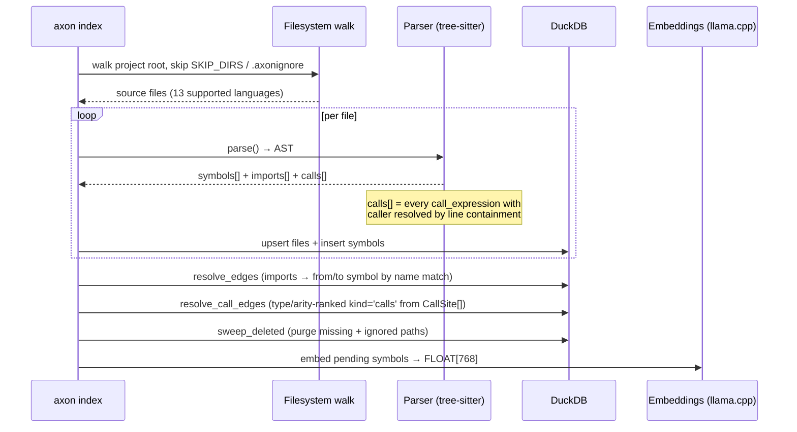
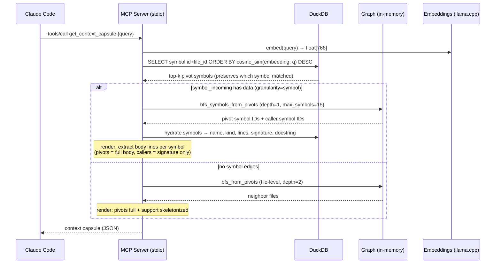

# Architecture

## Overview

Axon is a single C++20 binary with three serving modes: **stdio MCP** (JSON-RPC 2.0, consumed by Claude Code), **Web/HTTP** (`axon web` browser graph explorer plus REST API), and **stdio LSP** (`axon lsp`, consumed by editors). All modes share the same DuckDB index built by the indexer.

## Components

| Component | Responsibility | Key files |
|-----------|---------------|-----------|
| **CLI** | Argument parsing, mode dispatch | `src/main.cpp` |
| **Indexer** | Walk files → parse AST → insert DB (2-pass) | `src/core/indexer.*` |
| **Parser** | Language dispatcher + symbol/import/call-site extraction | `src/parser/parser.*` |
| **Graph** | In-memory adjacency lists (file + symbol) + bidirectional BFS + symbol BFS | `src/core/graph.*` |
| **Capsule** | Pivot selection + token-budget context assembler (symbol or file mode) | `src/core/capsule.*` |
| **Skeleton** | Signatures-only view via tree-sitter re-parse | `src/core/skeleton.*` |
| **Embeddings** | llama.cpp wrapper (embed + batch embed) | `src/core/embeddings.*` |
| **Registry** | Multi-repo registry (`~/.axon/registry.json`) | `src/core/registry.*` |
| **Git** | Git diff parsing for `detect_changes` | `src/core/git.*` |
| **Routes** | HTTP route detection for `route_map` / `api_impact` | `src/core/routes.*` |
| **Rename** | Graph-assisted symbol rename | `src/core/rename.*` |
| **DB** | DuckDB connection + schema + migrations | `src/core/db.*` |
| **Config** | Project root detection via `.git` walk-up | `src/core/config.*` |
| **Dialogue** | Threads/sessions/turns/anchors/digests + typed handoffs + auto-anchor + ADF | `src/core/dialogue.*` |
| **Memory Search** | Semantic/lexical RRF fusion + bounded authority | `src/core/memory_search.*` |
| **Pending Writes** | Atomic capture claim, retry accounting, poison-batch preservation | `src/core/pending_writes.*` |
| **MCP Server** | stdio JSON-RPC 2.0 loop + 33 tool handlers | `src/mcp/server.*` |
| **HTTP Server** | Browser graph explorer, REST API, and multi-repo graph aggregation | `src/mcp/http_server.*` |
| **LSP Server** | Language Server Protocol stdio loop for workspace/document symbols, definitions, and references | `src/lsp/server.*` |
| **Protocol** | `make_response` / `make_error` / `make_tool_result` | `src/mcp/protocol.hpp` |

## Data Flow

### Indexing (once per change)

### Capsule assembly (per query)

## Design Decisions

**1. DuckDB over SQLite for vector storage**
DuckDB supports `FLOAT[768]` array columns natively, enabling cosine similarity queries without a separate vector store. Trade-off: heavier binary, but zero extra dependencies.

**2. Tree-sitter for parsing (not regex)**
Tree-sitter produces a proper CST that survives syntactically valid-but-unusual code. Regex-based import extraction breaks on multiline imports, comments inside import blocks, and language-specific edge cases. Trade-off: 18 grammar submodules add build complexity.

**3. stdio MCP, Web/HTTP, and LSP**
Claude Code's MCP transport is stdio JSON-RPC, browsers need HTTP, and editors speak LSP. Keeping three thin serving adapters over one DuckDB graph avoids duplicating indexing logic. Trade-off: three protocol surfaces to keep compatible.

**4. 2-pass indexing (files then edges)**
Files are inserted in pass 1 so that edge FKs (`from_file`, `to_file`) are always valid in pass 2. Alternative (single pass with deferred constraints) was messier to implement in DuckDB.

**5. Read-only mode for secondary repos**
When aggregating multi-repo graphs, secondary DBs are opened in `READ_ONLY` mode to prevent lock conflicts with the primary repo's MCP server, which may be running concurrently.

**6. Peer-proxy between concurrent serves**
DuckDB grants the write lock to one process. Rather than making every other serve fail, the lock holder runs a token-gated peer listener on `127.0.0.1` (ephemeral port, published with its pid in `~/.axon/registry.json`) and latecomer serves forward tool calls to it. When the owner exits, the next tool call on a latecomer opens the DB directly and takes over ownership. Trade-off: one extra thread per serve and a localhost HTTP hop for proxied calls, in exchange for concurrent sessions never hitting lock errors.

**7. Symbol-mode capsule with file-mode fallback**
When `symbol_incoming` has data, `assemble_capsule` extracts only the matched symbol bodies — pivots get full bodies (cap `budget/16`), callers get signature + 2-3 lines (cap `budget/80`). When no symbol-level edges exist, the function falls back to file-level BFS with skeletonized support. Trade-off: dual rendering paths to maintain, but the capsule degrades gracefully on repos without `granularity = "symbol"` enabled.

**8. Type-aware caller and callee resolution**
The parser emits one `CallSite{caller, callee, qualifier, argument_count, line}` per call AST node, then a post-pass picks the smallest enclosing caller symbol whose line range contains it. Callee candidates are ranked by receiver/enclosing owner type, signature arity, locality, and production-file preference before a stable-ID fallback. This stays cross-language without a compiler frontend. Trade-off: variable receivers whose declared type cannot be inferred still use arity/locality fallback, and module-level calls are dropped because they have no function-level caller.

## Constraints & Trade-offs

| Constraint | Impact |
|-----------|--------|
| DuckDB single-writer | Multi-repo aggregation opens secondaries in READ_ONLY; concurrent serves on one repo proxy tool calls to the lock holder |
| llama.cpp CPU inference | Embedding 50k symbols takes ~60s on first index; incremental reindex is fast |
| tree-sitter 18 grammars | First build ~10–12 min; ccache makes subsequent builds ~3 min |
| Callee resolution | Receiver/owner and arity are heuristic rather than a full compiler type system; unknown variable receivers fall back deterministically |
| Noverlap sync | Skipped for graphs > 5000 nodes to prevent UI freeze in axon-web |
| Call graph requires `granularity = "symbol"` | Default is `"file"` for compatibility; opt-in via `.axon/config.toml` then `axon index --force` |
