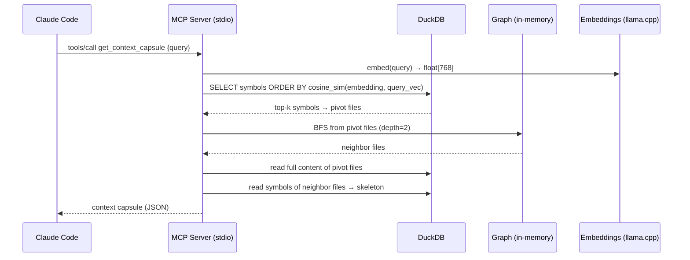

# Architecture

## Overview

Axon is a single C++20 binary with two serving modes: **stdio MCP** (JSON-RPC 2.0, consumed by Claude Code) and **HTTP REST** (consumed by axon-web). Both modes share the same DuckDB index built by the indexer.

## Components

| Component | Responsibility | Key files |
|-----------|---------------|-----------|
| **CLI** | Argument parsing, mode dispatch | `src/main.cpp` |
| **Indexer** | Walk files → parse AST → insert DB (2-pass) | `src/core/indexer.*` |
| **Parser** | Language dispatcher + symbol/import extraction | `src/parser/parser.*` |
| **Graph** | In-memory adjacency list + bidirectional BFS | `src/core/graph.*` |
| **Capsule** | Pivot selection + token-budget context assembler | `src/core/capsule.*` |
| **Skeleton** | Signatures-only view via tree-sitter re-parse | `src/core/skeleton.*` |
| **Embeddings** | llama.cpp wrapper (embed + batch embed) | `src/core/embeddings.*` |
| **Registry** | Multi-repo registry (`~/.axon/registry.json`) | `src/core/registry.*` |
| **Git** | Git diff parsing for `detect_changes` | `src/core/git.*` |
| **Routes** | HTTP route detection for `route_map` / `api_impact` | `src/core/routes.*` |
| **Rename** | Graph-assisted symbol rename | `src/core/rename.*` |
| **DB** | DuckDB connection + schema + migrations | `src/core/db.*` |
| **Config** | Project root detection via `.git` walk-up | `src/core/config.*` |
| **MCP Server** | stdio JSON-RPC 2.0 loop + 15 tool handlers | `src/mcp/server.*` |
| **HTTP Server** | REST API + multi-repo graph aggregation | `src/mcp/http_server.*` |
| **Protocol** | `make_response` / `make_error` / `make_tool_result` | `src/mcp/protocol.hpp` |

## Data Flow

## Design Decisions

**1. DuckDB over SQLite for vector storage**
DuckDB supports `FLOAT[768]` array columns natively, enabling cosine similarity queries without a separate vector store. Trade-off: heavier binary, but zero extra dependencies.

**2. Tree-sitter for parsing (not regex)**
Tree-sitter produces a proper CST that survives syntactically valid-but-unusual code. Regex-based import extraction breaks on multiline imports, comments inside import blocks, and language-specific edge cases. Trade-off: 13 grammar submodules add build complexity.

**3. stdio MCP (not HTTP-only)**
Claude Code's MCP transport is stdio JSON-RPC. Adding HTTP was a secondary feature for the visual frontend. The stdio path is the primary integration point. Trade-off: two serving modes to maintain.

**4. 2-pass indexing (files then edges)**
Files are inserted in pass 1 so that edge FKs (`from_file`, `to_file`) are always valid in pass 2. Alternative (single pass with deferred constraints) was messier to implement in DuckDB.

**5. Read-only mode for secondary repos**
When aggregating multi-repo graphs, secondary DBs are opened in `READ_ONLY` mode to prevent lock conflicts with the primary repo's MCP server, which may be running concurrently.

## Constraints & Trade-offs

| Constraint | Impact |
|-----------|--------|
| DuckDB single-writer | Multi-repo aggregation opens secondaries in READ_ONLY |
| llama.cpp CPU inference | Embedding 50k symbols takes ~60s on first index; incremental reindex is fast |
| tree-sitter 13 grammars | First build ~10–12 min; ccache makes subsequent builds ~3 min |
| BFS is file-granular | `get_callers` precision is file-level, not call-site level |
| Noverlap sync | Skipped for graphs > 5000 nodes to prevent UI freeze in axon-web |
