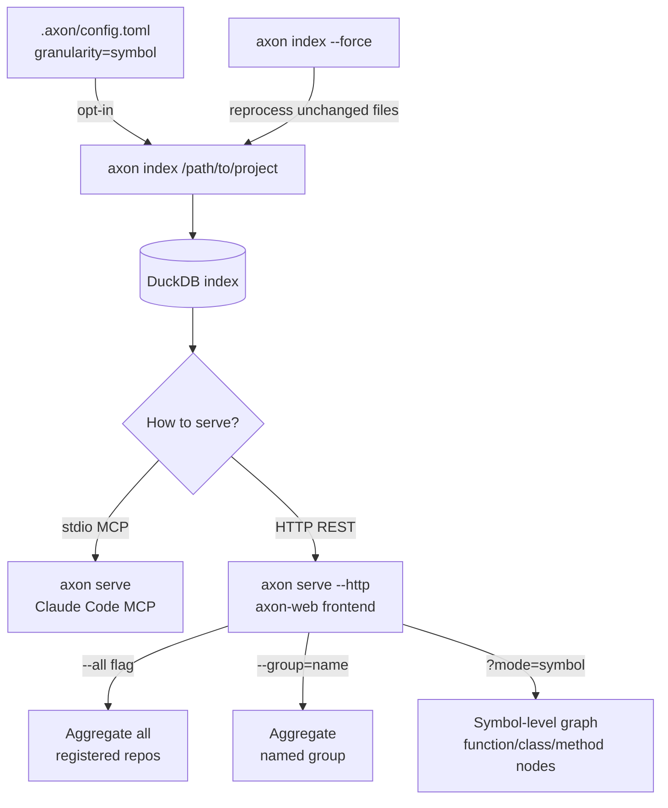

# Getting Started with axon

This guide walks you through installing axon, indexing your first project, and using it inside Claude Code.

---

## Operating Modes



## Glossary

| Term | Definition |
|------|-----------|
| **Context capsule** | Token-budget-aware context blob: pivot files complete + support files as signatures only |
| **Pivot file** | A file identified as directly relevant to the current query or task |
| **Support file** | A file in the dependency neighborhood of a pivot — included as skeleton only |
| **Skeleton** | A file stripped to signatures (functions, classes, types) — no function bodies |
| **BFS** | Breadth-First Search — the traversal algorithm axon uses to explore the dependency graph |
| **Embedding** | A 768-dimension vector representation of text, used for semantic similarity search |
| **Registry** | `~/.axon/registry.json` — global list of indexed repos and named groups |
| **Group** | A named set of repos in the registry, used with `--group=<name>` for targeted aggregation |
| **Write-through** | Axon hooks that auto-reindex files after every `Edit`/`Write` in Claude Code |
| **MCP** | Model Context Protocol — the stdio JSON-RPC protocol Claude Code uses to talk to axon |
| **Granularity** | `"file"` (default) emits file-to-file edges; `"symbol"` adds tree-sitter call graph extraction — `kind='calls'` edges with `from_symbol`/`to_symbol` populated |
| **Call site** | A `call_expression` AST node — recorded as `CallSite{caller, callee, line}`; the caller is the smallest enclosing symbol whose line range contains it |
| **Symbol BFS** | Breadth-first traversal over `symbol_incoming` (callers). Expands a pivot symbol to its caller symbols (depth=1) for the capsule |

---

## Prerequisites

| Tool | Minimum version | Notes |
|------|----------------|-------|
| GCC or Clang | 12 | C++20 required |
| CMake | 3.20 | Build system |
| Git | any | For `--recurse-submodules` |
| ccache | any | Recommended — ~70% faster rebuilds |
| Python + pip | 3.8 | Only needed for embedding model download |

---

## Installation

### Step 1 — Clone with submodules

```bash
git clone --recurse-submodules https://github.com/HideakiSolutions/axon.git
cd axon
```

If you already cloned without `--recurse-submodules`:

```bash
git submodule update --init --recursive
```

### Step 2 — Build

```bash
mkdir build && cd build
cmake .. -DCMAKE_BUILD_TYPE=Release
make -j2
```

Expected output (last lines):

```
[100%] Linking CXX executable axon
[100%] Built target axon
```

> **Why `-j2`?** The llama.cpp + 13 tree-sitter grammar compilation is memory-intensive. Higher parallelism can lock up shared development hosts. First build: ~10–12 min. Subsequent builds with ccache: ~3 min.

### Step 3 — Set library path

```bash
export LD_LIBRARY_PATH=/path/to/axon/third_party/duckdb/lib
# Persist it:
echo 'export LD_LIBRARY_PATH=/path/to/axon/third_party/duckdb/lib' >> ~/.bashrc
```

### Step 4 — (Optional) Download embedding model

Enables `search_memory` and semantic mode of `get_context_capsule`:

```bash
pip install huggingface_hub
huggingface-cli download nomic-ai/nomic-embed-text-v1.5-GGUF \
    nomic-embed-text-v1.5.Q4_K_M.gguf \
    --local-dir /path/to/axon/models/
```

### Step 5 — Configure Claude Code

Add to `~/.claude.json`:

```json
{
  "mcpServers": {
    "axon": {
      "command": "/path/to/axon/build/axon",
      "args": ["serve"],
      "env": {
        "LD_LIBRARY_PATH": "/path/to/axon/third_party/duckdb/lib"
      }
    }
  }
}
```

---

## First 10 Minutes

### 1. Index your project

```bash
axon index /path/to/your-project
```

Expected output:

```
[axon] Indexing /path/to/your-project...
[axon] Found 847 files (TypeScript: 612, Python: 235)
[axon] Parsed 847 files, 12,431 symbols, 8,904 edges
[axon] Embeddings: 12,431/12,431 (768-dim, nomic-embed)
[axon] Done in 4.2s
```

### 2. Check the index

```bash
axon status
```

### 3. Start MCP server

```bash
axon serve
```

Claude Code connects automatically when you open a session in the indexed project.

### 4. Try your first tool call

In Claude Code, ask:

```
Give me an overview of this codebase.
```

Claude will call `get_overview` and return the most coupled files and referenced symbols.

```
What would break if I change src/auth/token.ts?
```

Claude will call `get_impact_graph` and `get_tests_for` automatically.

### 5. (Optional) Open axon-web

```bash
# Start HTTP server (in background)
axon serve --http --port=7070 &

# In axon-web directory:
npm run dev
# Open http://localhost:5173
```

### 6. (Optional) Enable symbol-level granularity

By default, axon indexes file-level edges. Symbol-level edges (`kind='calls'`) unlock the granular BFS in `get_context_capsule` — pivots expand to their callers, and the capsule extracts only matched symbol bodies instead of full files.

To enable, create `.axon/config.toml` in your project root:

```toml
granularity = "symbol"
```

Then force-reindex so the existing files get the new edge resolution:

```bash
axon index --force
```

Verify the call graph was populated:

```bash
curl -s "http://localhost:7070/api/graph?mode=symbol" | jq '.edges | length'
# Should print > 0 once symbol-level edges exist
```

---

## Common Workflows

| When | What to run |
|------|-------------|
| Starting work on an unfamiliar codebase | `get_overview` → `get_context_capsule` |
| Before refactoring a file | `get_impact_graph` + `get_tests_for` |
| Debugging — tracing where a symbol is called | `get_callers` → `get_skeleton` |
| Checking which HTTP routes are affected | `route_map` → `api_impact` |
| After recent git changes | `detect_changes` |
| Looking for something remembered in a past session | `search_memory` |
| Checking impact across multiple repos | `group_list` → `group_impact` |

---

## What's Next

- [Architecture](architecture.md) — how axon works internally
- [API Reference](api-reference.md) — all 26 MCP tools with parameters
- [FAQ](faq.md) — common questions
- [Troubleshooting](troubleshooting.md) — build and runtime problems
