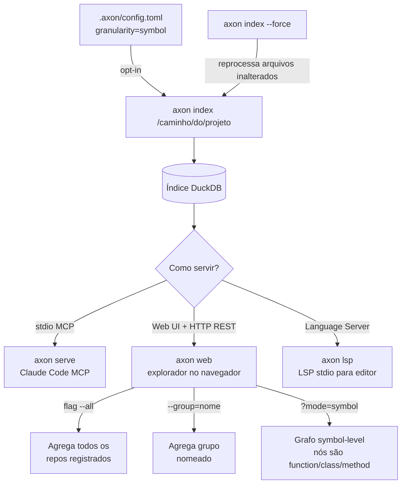

# Primeiros Passos com o axon

Este guia orienta a instalação do axon, indexação do primeiro projeto e uso dentro do Claude Code.

---

## Modos de operação



## Glossário

| Termo | Definição |
|-------|-----------|
| **Cápsula de contexto** | Blob de contexto com orçamento de tokens: arquivos pivô completos + suporte como assinaturas |
| **Arquivo pivô** | Arquivo identificado como diretamente relevante para a query ou tarefa atual |
| **Arquivo de suporte** | Arquivo na vizinhança de dependências de um pivô — incluído apenas como esqueleto |
| **Esqueleto** | Arquivo reduzido a assinaturas (funções, classes, tipos) — sem corpos de função |
| **BFS** | Busca em Largura — algoritmo de travessia que o axon usa no grafo de dependências |
| **Embedding** | Representação vetorial de 768 dimensões de um texto, usada para busca semântica |
| **Registro** | `~/.axon/registry.json` — lista global de repos indexados e grupos nomeados |
| **Grupo** | Conjunto nomeado de repos no registro, usado com `--group=<nome>` |
| **Write-through** | Hooks do axon que reindexam arquivos automaticamente após cada `Edit`/`Write` no Claude Code |
| **MCP** | Model Context Protocol — protocolo stdio JSON-RPC que o Claude Code usa para falar com o axon |
| **Granularidade** | `"file"` (padrão) emite arestas arquivo-a-arquivo; `"symbol"` adiciona extração do call graph via tree-sitter — arestas `kind='calls'` com `from_symbol`/`to_symbol` populados |
| **Call site** | Nó AST `call_expression` — registrado como `CallSite{caller, callee, line}`; o caller é o menor símbolo cuja faixa de linhas contém a chamada |
| **Symbol BFS** | Travessia em largura sobre `symbol_incoming` (chamadores). Expande um pivô para os símbolos que o chamam (depth=1) na cápsula |

---

## Pré-requisitos

| Ferramenta | Versão mínima | Observações |
|-----------|--------------|-------------|
| GCC ou Clang | 12 | C++20 obrigatório |
| CMake | 3.20 | Sistema de build |
| Git | qualquer | Para `--recurse-submodules` |
| ccache | qualquer | Recomendado — ~70% mais rápido em rebuilds |
| Python + pip | 3.8 | Apenas para download do modelo de embeddings |

---

## Instalação

### Passo 1 — Clonar com submódulos

```bash
git clone --recurse-submodules https://github.com/HideakiSolutions/axon.git
cd axon
```

### Passo 2 — Compilar

```bash
mkdir build && cd build
cmake .. -DCMAKE_BUILD_TYPE=Release
make -j2
```

> **Por que `-j2`?** A compilação do llama.cpp + 13 gramáticas do tree-sitter é intensiva em memória. Primeira build: ~10–12 min. Com ccache: ~3 min.

### Passo 3 — Configurar library path

```bash
export LD_LIBRARY_PATH=/caminho/para/axon/third_party/duckdb/lib
echo 'export LD_LIBRARY_PATH=/caminho/para/axon/third_party/duckdb/lib' >> ~/.bashrc
```

### Passo 4 — (Opcional) Baixar modelo de embeddings

```bash
pip install huggingface_hub
huggingface-cli download nomic-ai/nomic-embed-text-v1.5-GGUF \
    nomic-embed-text-v1.5.Q4_K_M.gguf \
    --local-dir /caminho/para/axon/models/
```

### Passo 5 — Configurar Claude Code

Adicionar ao `~/.claude.json`:

```json
{
  "mcpServers": {
    "axon": {
      "command": "/caminho/para/axon/build/axon",
      "args": ["serve"],
      "env": {
        "LD_LIBRARY_PATH": "/caminho/para/axon/third_party/duckdb/lib"
      }
    }
  }
}
```

---

## Primeiros 10 Minutos

```bash
# 1. Indexar o projeto
axon index /caminho/para/seu-projeto

# 2. Verificar o índice
axon status

# 3. Iniciar o servidor MCP
axon serve
```

### (Opcional) Abrir o Axon Web

```bash
axon web --port=7070
# Abrir http://localhost:7070
```

### (Opcional) Habilitar granularidade symbol-level

Por padrão, o axon emite apenas arestas arquivo-a-arquivo. Para habilitar o call graph (arestas `kind='calls'` com `from_symbol`/`to_symbol`), crie `.axon/config.toml`:

```toml
granularity = "symbol"
```

Depois force a reindexação para reprocessar arquivos cujo hash não mudou:

```bash
axon index --force
```

Isso ativa o BFS granular em `get_context_capsule` — pivôs expandem para seus chamadores, e a cápsula extrai apenas os corpos dos símbolos relevantes em vez de arquivos inteiros.

---

## Fluxos Comuns

| Quando | O que executar |
|--------|---------------|
| Início de trabalho em codebase desconhecida | `get_overview` → `get_context_capsule` |
| Antes de refatorar um arquivo | `get_impact_graph` + `get_tests_for` |
| Debug — rastreando onde um símbolo é chamado | `get_callers` → `get_skeleton` |
| Verificando rotas HTTP afetadas | `route_map` → `api_impact` |
| Após mudanças recentes no git | `detect_changes` |
| Buscando algo recordado em sessão anterior | `search_memory` |
| Verificando impacto em múltiplos repos | `group_list` → `group_impact` |

---

## Próximos passos

- [Arquitetura](architecture.md)
- [Referência de API](api-reference.md)
- [FAQ](faq.md)
- [Solução de Problemas](troubleshooting.md)
